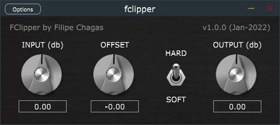

# FClipper-plugin

A simple clipping plug-in made with JUCE

To build this, open the file *NewProject.jucer* with Projucer, export to an IDE and compile to the desired format (AAX, VST, VST3, etc).
