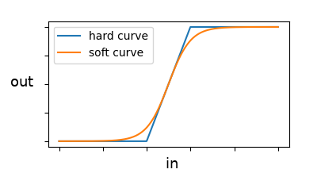

# FClipper audio plugin

A simple clipping plug-in made with JUCE

## Download Links

* [VST3 for Windows](https://github.com/FilipeChagasDev/FClipper-plugin/releases/download/v1.1.1/FClipper_VST3_installer_v1.1.1.exe)
* [Standalone for Linux](https://github.com/FilipeChagasDev/FClipper-plugin/releases/download/v1.1.1/FClipper_v1.1.1_standalone_for_Linux.tar.xz)

## Demos

* [FClipper VST3 plugin demo (YouTube video)](https://youtu.be/j_6yU3-7Z48)
* [Mixing drums with FClipper v1.1.1 and equalizer (YouTube video)](https://youtu.be/QskxQDYrzt4)

## User Manual

FClipper has 4 controls: **Input**, **Offset**, **Hard/Soft** and **Output**.

* **Input** - Input gain in decibels. Use this control to adjust the clipping intensity.
* **Offset** - When the value of this control is non-zero, a constant is added to the input signal causing clipping asymmetry.
* **Hard/Soft** - This switch selects a I/O curve for the clipping.

* **Output** - Output gain in decibels. Use this control to compensate the input gain.

